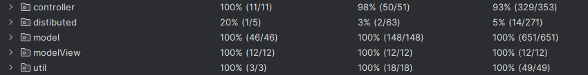

:strip_icc()/pic7193695.png)

# My Shelfie Videogame
## Overview
The program is a digital implementation in `Java` of the <b>My Shelfie</b> tabletop game by <b>Cranio Games</b>.

You have postponed this as long as possible, but now it’s time to reorganize your library and put your favorite objects back in place. Will you be able to do it faster than other players, satisfying the required patterns? In a 3D support, which reproduces a real library, you will take the game tiles from a common board. Then you will insert the board tiles in the 3D support making them fall from the top. In doing so, you will have to try to recreate the patterns of your personal or common target. An eye-catcher and strategy game, different each time thanks to the multiplicity of common targets of which you will use only 2 in each game. The realistic images of the object tiles will make you feel like you are really tidying up your precious library shelves.
### Authors
Project developed by:
- [Negro Giorgio]
- [Enrico Tirri]
- [Rebecca Maria Tacchi]
- [Luca Prada]

### License

All rights to My Shelfie game are owned by Cranio Games, which provided the graphical resources to be used for educational purposes only.

## Project Specifications
The project consisted of developing a digital version of the tabletop game My Shelfie according to the rules described in the `specifications/rules.pdf` document. 

The program is realized following a Model-View-Controller design pattern: UML diagrams are provided to clarify the structure and dynamics of the code.

A game instance is made up of a single server and multiple clients, which connect to it.

As part of the grading of the project, a number of possible functionalities could be implemented (these are described in greater detail in the `specifications/requirements.pdf` document). The implemented functionalities are:

- Complete Rules: games of 2-4 players, with all features describe in the rulebook for a normal game.
- Socket: remote connection to the server.
- RMI: remote connection to the server.
- CLI: command line game interface.
- GUI: graphical game interface realized with Java Swing.
- Multiple games: server can host multiple game instances.
- Chat: players can send messages to each other.
- Disconnection resilience: players can disconnect and reconnect to the server, game will continue without them allowing rejoining.

## Running the Game
The game consists of a two jar files by the name <code>MyShelfieClient.jar</code> and <code>MyShelfieServer.jar</code>. They can be found in <code>/target</code> directory after building the project with Maven. 

To run the  client file, use the command

<code>java -jar MyShelfieClient.jar</code>

with the following options:

- <code>-ui [type]</code> TUI or GUI, default is TUI
- <code>-hip [hip]</code> server ip address, default is localhost
- <code>-cip [cip]</code> client ip address, default is localhost (only necessary for RMI)
- <code>-rP [rmi Port]</code> RMI port, default is 1099
- <code>-sP [socket port]</code> socket port, default is 10101
- <code>-h</code> help

from the command line in the jar's folder.

To run the server file, use the command

<code>java -jar MyShelfieServer.jar</code>

with the following options:

- <code>-ip [ip]</code> server ip address, default is localhost
- <code>-rP [rmi Port]</code> RMI port, default is 1099
- <code>-sP [socket Port]</code> socket port, default is 10101
- <code>-h</code> help

Linux's consoles are supported. Windows cmd console and Powershell < 5.0 are supported, but the colors and cursor position may not be displayed correctly. Powershell >= 5.0 is fully supported.

### Server

The machine running the server must be reachable from the clients in order to play the game. It's important to set ip if clients will be connection through LAN/WLAN.

Once launched, the server will print the events' on the standard output.

### Client

The CLI and GUI versions of the client can be run by adding the respective flags to the command line, it's important to set hip, and cip (if planning to use RMI).

At startup, the client will ask the user to select the connection type (RMI or socket).

In both cases, losing connection with the server will cause the client to ask the user again to select the connection type. 

#### Login

After selecting the connection type, the user will have to either create or join a game.

To create a game, the user will have to select a game name/id and the number of players for the game. The game name/id must be unique (will be checked by the server and the user will be asked to select a different name if the one selected is already in use). The player count must be between 2 and 4 (inclusive).
To join a game, the user will have to insert a valid game name/id and a unique username. The game must exist and be joinable (i.e. not already started, not full and not ended).

A user cannot provide the same username as that of one of the players of a running game, unless that player has disconnected.
Providing the username of a disconnected player will reconnect them and provide access to their game.

A user can create multiple games and join one of them. The rest will be available for other players to join.

Disconnecting during the login phase will cause the game to terminate.

#### Game setup

The game will determine a turn order randomly, will assign a personal goal to each player, will pick two common goals and fill the living room with the tiles.

#### Turns

During each player's turn, they will have to select one to three Tiles from the available Tiles in the living room, and place them in one column of their shelf, according to the game rules.

Disconnecting during a turn will cause the player to skip their turn.

During both the player's turn and the other players' turns, the player will be able to see the other players' shelves and the common goals. The player will also be able to send messages to the other players.

#### After the game ends

Once the game ends, all players will be informed of the winner's identity and the final scores.
The game will then return to the login phase.

#### Game interruptions

If a game's player disconnects from the server their game will continue whilst skipping their turn.
A disconnected player can reconnect to their game by logging in using the same username, and will be able to take their turn normally once it arrives.

If only one player remains in a game there will be a 6 seconds countdown before the game ends with the remaining player as the winner.

### TUI controls

#### Login
- <code>c</code> create a new game, you will be asked to provide a game name/id and the number of players for the game
- <code>j</code> join a game, you will be asked to provide a game name/id and a username
- <code>e</code> exit the game

#### Game routine
- <code>p</code> pick tiles from the living room and place them in your shelf, you will be asked to provide the tiles' coordinates and subsequently the column in which to place them
- <code>s</code> send a message to the other players, you will be asked to provide the recipient's username and the message
- <code>e</code> exit the game

## File System Structure

* `deliverables\peer-reviews`: peer reviews written for "Prova finale Ingegneria del Software" course at Politecnico di Milano
* `deliverables\specifications`: specifications for the project and ruleset for the game
* `deliverables\target`: `jar` files for running the game
* `deliverables\umls`: various explanatory documents, such as a description of the connection protocol and UMLs
* `deliverables\javadoc`: documentation for the classes and methods generated from the comments in the code
* `src`: code of the project and tests

## Test Coverage

[Test Details](https://giorgionegro.github.io/ing-sw-2023-negro-tirri-tacchi-prada?token=1353546)
